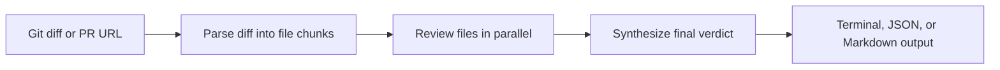

# diff-review

[](https://github.com/machinellabs/diff-review/actions/workflows/ci.yml)

`diff-review` is a command-line tool that reviews git diffs with Claude. It works with local diffs, saved patch files, and GitHub pull request URLs.

The goal is simple: get a second pass on a change before merging it, with output that is easy to read in the terminal or reuse in another workflow.

## What it does

- Reviews staged changes, branch diffs, commits, saved `.diff` files, or GitHub PRs
- Breaks large diffs into per-file chunks before asking Claude to review them
- Combines the file-level notes into one final verdict
- Optional `--security` mode: reviews against a security ruleset and runs a local secrets scan
- Returns terminal output, JSON, or Markdown
- Includes file names, severity, suggestions, and quoted evidence from the diff
- Prints token usage and an estimated cost for each run

## How it works



Pipeline:

1. **Parse** - split the diff into file-level chunks
2. **Review** - send file chunks to Claude in parallel, up to 8 at a time
3. **Synthesize** - combine the file reviews into a final verdict

## How to run it

### Install

Use `pipx` for a normal install:

```bash
pipx install git+https://github.com/machinellabs/diff-review
```

On macOS, install `pipx` with:

```bash
brew install pipx
```

For local development:

```bash
git clone https://github.com/machinellabs/diff-review.git
cd diff-review
python -m venv .venv
source .venv/bin/activate
pip install -e ".[dev]"
```

### Configure

Set an Anthropic API key before running real reviews:

```bash
export ANTHROPIC_API_KEY=your-key-here
```

For private GitHub repos, or to avoid public API rate limits, set a GitHub token too:

```bash
export GITHUB_TOKEN=your-token-here
```

### Run

Review a GitHub pull request:

```bash
diff-review --pr https://github.com/owner/repo/pull/123
```

Review local changes:

```bash
git diff --cached | diff-review
git diff main...HEAD | diff-review
git show HEAD | diff-review
```

Save Markdown or JSON output:

```bash
git diff main...HEAD | diff-review --markdown --output review.md
git diff main...HEAD | diff-review --json --output review.json
```

### Security review mode

`--security` switches the review to an application-security lens:

```bash
git diff main...HEAD | diff-review --security
diff-review --pr https://github.com/owner/repo/pull/123 --security
```

In this mode the reviewer only reports security-relevant findings, judged
against a fixed ruleset:

| Rule | Focus |
|------|-------|
| `SEC-INJ` | SQL, command, and template injection |
| `SEC-SECRET` | Hardcoded keys, tokens, and passwords |
| `SEC-AUTHZ` | Weakened permission or ownership checks |
| `SEC-DESER` | Unsafe deserialization of untrusted data |
| `SEC-PATH` | Path traversal |
| `SEC-SSRF` | Server-side request forgery |
| `SEC-CRYPTO` | Weak hashing, bad modes, disabled TLS checks |
| `SEC-XSS` | Unescaped output into HTML |

Each issue is tagged with its rule ID in the terminal table, Markdown, and
JSON output.

Security mode also runs a local regex pre-scan of the added lines for
committed secrets (AWS keys, GitHub/Slack/Anthropic tokens, private key
blocks, credential assignments). Those findings are merged into the review
deterministically — a committed secret gets flagged even if the model misses
it, and a high-severity hit blocks an `APPROVE` verdict.

### Test

From a development checkout:

```bash
pytest
```

## Example output

```text
╭─────────────────╮
│ REQUEST_CHANGES │
╰─────────────────╯

Summary
The changes introduce a new caching layer but the TTL logic has an off-by-one
error and there is no test coverage for the expiry path.

Severity   File            Issue                         Suggestion
high       src/cache.py    TTL comparison uses > not >=  Change to >= to include boundary
medium     src/cache.py    No test for expired entries   Add a test with a frozen clock

Highlights
  ✓ Clean separation between cache interface and storage backend
  ✓ Good use of type hints throughout

Tokens - reviews: 1,842 in / 398 out  | synthesis: 3,201 in / 287 out  | total: 5,043 in / 685 out  (~$0.0254)
```

Verdicts:

- `APPROVE` - looks good to merge
- `REQUEST_CHANGES` - issues should be addressed first
- `NEEDS_DISCUSSION` - needs a human call

## JSON output

```bash
git diff main...HEAD | diff-review --json
```

```json
{
  "verdict": "request_changes",
  "summary": "...",
  "issues": [
    {
      "severity": "high",
      "file": "src/cache.py",
      "description": "TTL comparison uses > not >=",
      "suggestion": "Change to >= to include boundary",
      "evidence": "+    if elapsed > ttl:"
    }
  ],
  "highlights": ["Clean separation between cache interface and storage backend"]
}
```

## Markdown output

Markdown output is useful for saving a review or pasting it into a GitHub comment:

```bash
git diff main...HEAD | diff-review --markdown
git diff main...HEAD | diff-review --markdown --output review.md
diff-review --pr https://github.com/owner/repo/pull/123 --markdown --output review.md
```

## Token usage

Every terminal run prints a per-phase token breakdown and cost estimate:

```text
Tokens - reviews: 1,842 in / 398 out  | synthesis: 3,201 in / 287 out  | total: 5,043 in / 685 out  (~$0.0254)
```

Token usage is not included in `--json` or `--markdown` output, so saved artifacts stay clean.

## Git aliases

```ini
[alias]
  review         = "!git diff main...HEAD | diff-review"
  review-staged  = "!git diff --cached | diff-review"
  review-last    = "!git show HEAD | diff-review"
```

Then use:

```bash
git review
git review-staged
git review-last
```

## GitHub Actions example

```yaml
- name: AI code review
  run: git diff ${{ github.base_ref }}...HEAD | diff-review
  env:
    ANTHROPIC_API_KEY: ${{ secrets.ANTHROPIC_API_KEY }}
```

This repo reviews its own pull requests with the workflow in
[`.github/workflows/review.yml`](.github/workflows/review.yml) — the Markdown
review shows up in the job summary of each PR.

## Development

For local development, use the install-from-source commands above, then run `pytest`.

## Configuration

| Environment variable | Default             | Description                                   |
|----------------------|---------------------|-----------------------------------------------|
| `ANTHROPIC_API_KEY`  | *(required)*        | Anthropic API key                             |
| `ANTHROPIC_MODEL`    | `claude-sonnet-4-6` | Model to use for review                       |
| `GITHUB_TOKEN`       | *(optional)*        | GitHub token for private repos or rate limits |

## Requirements

- Python 3.11+
- `ANTHROPIC_API_KEY` environment variable set for real reviews

## Project structure

```text
diff_review/
├── schema.py     # Pydantic output models + LangGraph state
├── nodes.py      # Parse, review, synthesize steps
├── graph.py      # LangGraph workflow wiring
├── formatter.py  # Rich terminal display + JSON/Markdown output
├── github.py     # GitHub API client for PR diffs
└── cli.py        # Entry point and argument parsing
```

## Versioning

This project follows [Semantic Versioning](https://semver.org/). See [CHANGELOG.md](CHANGELOG.md) for the full history.

## License

[MIT](LICENSE)
