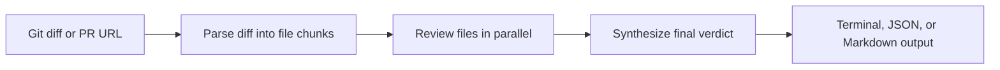

# diff-review

[](https://github.com/machinellabs/diff-review/actions/workflows/ci.yml)

An agentic AI code review CLI for local diffs and GitHub pull requests. It uses [LangGraph](https://github.com/langchain-ai/langgraph) to split a review into explicit parse, per-file review, and synthesis steps, then uses the [Claude API](https://www.anthropic.com) to return structured findings with evidence from the diff.

## Why this project matters

`diff-review` is built as a developer workflow tool, not a chatbot wrapper. It demonstrates:

- **Agentic workflow design** - a LangGraph pipeline coordinates parsing, parallel per-file review, and final synthesis.
- **Structured AI output** - findings are normalized with Pydantic models for CLI, JSON, and Markdown output.
- **Evidence-first review behavior** - issues include quoted diff evidence so feedback is grounded in the code change.
- **GitHub integration** - public PRs work without a token; private PRs can use `GITHUB_TOKEN`.
- **Cost visibility** - terminal output reports per-phase token usage and estimated Claude cost.

## How it works



`diff-review` runs a three-step pipeline instead of a single API call:

1. **Parse** - splits the diff into per-file chunks
2. **Review** - sends each file to Claude in parallel, up to 8 at once
3. **Synthesize** - aggregates all file reviews into a final verdict

This mirrors how a real engineer reviews a PR: read each file carefully, then form an overall opinion.

## Install

```bash
pipx install git+https://github.com/machinellabs/diff-review
```

> Requires [pipx](https://pipx.pypa.io/stable/installation/). On macOS: `brew install pipx`

## Setup

Get an API key from [console.anthropic.com](https://console.anthropic.com) and export it:

```bash
export ANTHROPIC_API_KEY=your-key-here
```

Each user runs against their own Anthropic account. Your key is never shared.

Optionally, set a GitHub token to review private repos or avoid rate limits:

```bash
export GITHUB_TOKEN=your-token-here  # optional - public repos work without it
```

## Usage

### Review a GitHub PR directly

```bash
# Public repo - no token needed
diff-review --pr https://github.com/owner/repo/pull/123

# Private repo
GITHUB_TOKEN=your-token diff-review --pr https://github.com/owner/repo/pull/123

# With JSON output
diff-review --pr https://github.com/owner/repo/pull/123 --json
```

### Review local changes

```bash
# Review staged changes before committing
git diff --cached | diff-review

# Review all uncommitted changes
git diff HEAD | diff-review

# Review your branch vs main before opening a PR
git diff main...HEAD | diff-review

# Review the last commit
git show HEAD | diff-review

# Review a saved diff file
diff-review path/to/changes.diff

# Get structured JSON output
git diff main...HEAD | diff-review --json

# Get Markdown output for GitHub comments, Notion, or saved reports
git diff main...HEAD | diff-review --markdown

# Save the review to a file
git diff main...HEAD | diff-review --output review.md
git diff main...HEAD | diff-review --json --output review.json

# Check version
diff-review --version
```

## Output

```text
╭─────────────────╮
│ REQUEST_CHANGES │
╰─────────────────╯

Summary
The changes introduce a new caching layer but the TTL logic has an off-by-one
error and there is no test coverage for the expiry path.

Severity   File            Issue                         Suggestion
high       src/cache.py    TTL comparison uses > not >=  Change to >= to include boundary
medium     src/cache.py    No test for expired entries   Add a test with a frozen clock

Highlights
  ✓ Clean separation between cache interface and storage backend
  ✓ Good use of type hints throughout

Tokens - reviews: 1,842 in / 398 out  | synthesis: 3,201 in / 287 out  | total: 5,043 in / 685 out  (~$0.0254)
```

**Verdicts:**

- `APPROVE` - looks good to merge
- `REQUEST_CHANGES` - issues found that should be addressed
- `NEEDS_DISCUSSION` - not wrong, but warrants a conversation

Each issue includes exact lines from the diff as evidence.

## JSON output

Use `--json` to get structured output for scripting or CI:

```bash
git diff main...HEAD | diff-review --json
```

```json
{
  "verdict": "request_changes",
  "summary": "...",
  "issues": [
    {
      "severity": "high",
      "file": "src/cache.py",
      "description": "TTL comparison uses > not >=",
      "suggestion": "Change to >= to include boundary",
      "evidence": "+    if elapsed > ttl:"
    }
  ],
  "highlights": ["Clean separation between cache interface and storage backend"]
}
```

## Markdown output

Use `--markdown` to get clean Markdown output that can be pasted into GitHub comments, Notion, or saved as a review artifact:

```bash
git diff main...HEAD | diff-review --markdown
git diff main...HEAD | diff-review --markdown --output review.md
diff-review --pr https://github.com/owner/repo/pull/123 --markdown --output review.md
```

## Token usage

Every terminal run prints a per-phase token breakdown and cost estimate at the bottom:

```text
Tokens - reviews: 1,842 in / 398 out  | synthesis: 3,201 in / 287 out  | total: 5,043 in / 685 out  (~$0.0254)
```

- **reviews** - sum of all parallel per-file Claude calls
- **synthesis** - the final aggregation call, with all file reviews as context
- Cost is estimated using [Claude pricing](https://www.anthropic.com/pricing)

Token usage is not included in `--json` or `--markdown` output so those artifacts stay clean for piping and saving.

## Git aliases

Add to `~/.gitconfig` for quick access from any repo:

```ini
[alias]
  review         = "!git diff main...HEAD | diff-review"
  review-staged  = "!git diff --cached | diff-review"
  review-last    = "!git show HEAD | diff-review"
```

Then use:

```bash
git review
git review-staged
git review-last
```

## CI / GitHub Actions

```yaml
- name: AI code review
  run: git diff ${{ github.base_ref }}...HEAD | diff-review
  env:
    ANTHROPIC_API_KEY: ${{ secrets.ANTHROPIC_API_KEY }}
```

## Development

```bash
git clone https://github.com/machinellabs/diff-review.git
cd diff-review
python -m venv .venv
source .venv/bin/activate
pip install -e ".[dev]"
pytest
```

## Configuration

| Environment variable | Default             | Description                                   |
|----------------------|---------------------|-----------------------------------------------|
| `ANTHROPIC_API_KEY`  | *(required)*        | Anthropic API key                             |
| `ANTHROPIC_MODEL`    | `claude-sonnet-4-6` | Model to use for review                       |
| `GITHUB_TOKEN`       | *(optional)*        | GitHub token for private repos or rate limits |

## Requirements

- Python 3.11+
- `ANTHROPIC_API_KEY` environment variable set for real reviews

## Project structure

```text
diff_review/
├── schema.py     # Pydantic output models + LangGraph state
├── nodes.py      # Three agent steps: parse, review, synthesize
├── graph.py      # LangGraph workflow wiring
├── formatter.py  # Rich terminal display + JSON/Markdown output
├── github.py     # GitHub API client for fetching PR diffs
└── cli.py        # Entry point and argument parsing
```

## Versioning

This project follows [Semantic Versioning](https://semver.org/). See [CHANGELOG.md](CHANGELOG.md) for the full history.
